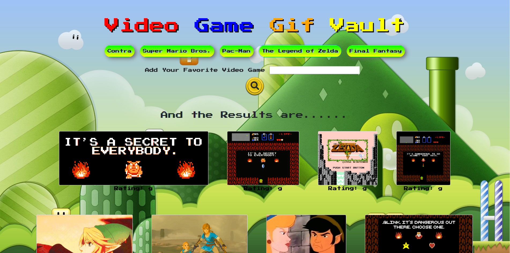

A simple app that displays Gifs of the users choice!  

## **Overview**
This is an app that will fetch Gifs using the Giphy API.  The user will be able to search for certain Gifs and display 10 of them on the screen at a time.  This is done by user created search buttons.  When the Gifs populate on the screen, the image will be still.  If the user clicks on the image once, the Gif will play.  If the user clicks on the image again, the Gif will pause. 

## Link To App
(https://blnicholson.github.io/GifTastic/) 

## Technical Information
This app was created by using the following:

* JavaScript
* HTML
* CSS
* AJAX
* jQuery
* Giphy API

